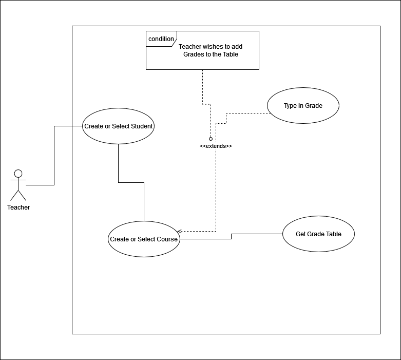
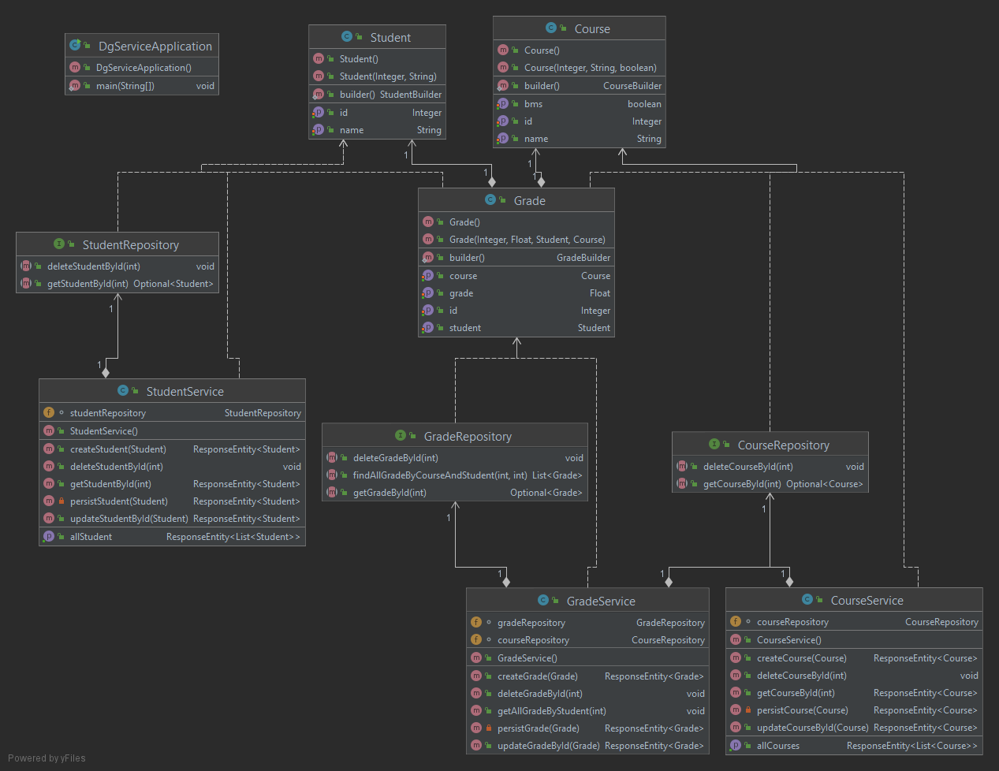
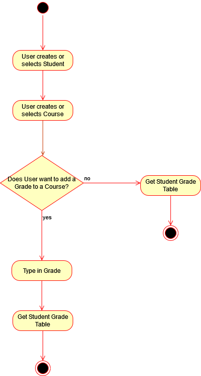

# deezGrades

> Für bessere Ansicht auf [Github](https://github.com/blauWhale/deezGrades) ansehen.

## Analyse

### Ausgangslage

Wir wollen eine Notenverwaltungsapp mit ReactJS und Springboot realisieren, die App soll zusätzlich über eine SQL Datenbank verfügen.

### Aufteilung

**Oliver**: Frontend mit ReactJS

**Raphael**: Datenbank mit MySQL

**Samuel**: Backend mit SpringBoot

### Risiken

Da wir alle drei gute Kenntnisse haben in unseren Feldern, sollen keine grossen Risiken aufkommen, ausser beim Deployen der App.

## Design

### Diagramme

#### Use Case

#### Klassendiagramm

#### Aktivitätsdiagramm

#### Architektur Design

### Technologie

**ReactJS**: Wir haben uns für dieses Frontend Framework entschieden, da wir schon im Geschäft damit Erfahrung gesammelt haben.

**SpringBoot**: Spring wurde gewählt, da es momentan, wie auch voraussichtlich in der Zukunft, das am weitesten verbreitete Java API Framework ist. Zudem vereinfacht es die Umsetzung der Applikation.

### Test Cases

| Case                        |
| --------------------------- |
| Zeigt Hauptseite            |
| Student Erstellen           |
| Student Auswählen           |
| Course Erstellen            |
| Course Auswählen            |
| Grade Eingeben              |
| Ungültige Grade Eingeben    |
| Course Grade Table Anzeigen |

### GUI Design

## Implementierung

### Schwierigkeiten

### Problemlösungen

Jegliche Probleme wurden, wenn man selber nicht weiterkam, stets zusammen in der Gruppe gelöst.

### Source Code Organisation

Der API Code ist MVC gemäss gegliedert. Wir haben einen Model Layer, wo alle Datenbank Klassen definiert sind, 
einen Persistence Layer, wo die Datenbank Verbindung mithilfe von Jpa stattfindet 
und einen Service Layer, wo alle Methoden, die im Frontend benötigt werden, definiert sind.

Im Frontend ist der Code dem React Standard nach organisiert. Wir haben einen Components Ordner, wo eben alle benötigten Komponenten programmiert sind.
Und einen Pages Ordner, wo die wichtigsten Stammteile sind, wie Model oder API.

## Test

### Funktionstests

| Case                        | Eingabe                     | Erwartet                                                          | Tatsächlich                                                         | OK/NOK |
| ------------------          | --------------------------- | ----------------------------------------------------------------- | ------------------------------------------------------------------- | ------ |
| Zeigt Hauptseite            | Programmstart               | Zeigt Hauptseite                                                  | Zeigt Hauptseite                                                    | OK     |
| Student Erstellen           | Max                         | Max wird erstellt und eine Konfirmationsmaske wird angezeigt      | Max wurde erstellt und Konfirmationsmaske wurde angezeigt           | OK     |
| Student Auswählen           | Max                         | Max wird ausgewählt und eine Konfirmationsmaske wird angezeigt    | Max wird ausgewählt und eine Konfirmationsmaske wurde angezeigt     | OK     |
| Course Erstellen            | Mathematik                  | Course wird erstellt und eine Konfirmationsmaske wird angezeigt   | Course wurde erstellt und eine Konfirmationsmaske wurde angezeigt   | OK     |
| Course Auswählen            | Mathematik                  | Course wird ausgewählt und eine Konfirmationsmaske wird angezeigt | Course wurde ausgewählt und eine Konfirmationsmaske wurde angezeigt | OK     |
| Grade Eingeben              | 6                           | Grade wird gespeichert und eine Konfirmationsmaske wird angezeigt | Grade wurde gespeichert und eine Konfirmationsmaske wurde angezeigt | OK     |
| Ungültige Grade Eingeben    | 8                           | Error Message wird angezeigt                                      | Error Message wurde angezeigt                                       | OK     |
| Course Grade Table Anzeigen | Auf den Tab klicken         | Grade Table wird angezeigt mit den korrekten Angaben              | Grade Table wurde korrekt angezeigt                                 | OK     |

## Reflektionen

### Oliver

### Raphael

Das Projekt war sehr spannend und war ideal in Verbindung mit dem Springboot Projekt das wir in unserer Lehrfirma Generali angehen. Die Umsetzung der Datenbank gestalltete und normalisierte ich mit der SQL-Workbench. In der Springboot Applikation bindete ich Repositories ein und setzte Hibernate ein um nicht SQL Statements zu schreiben. Der Lerneffekt speziel mit Hibernate JPA war gross und es macht mir grossen Spass. Die Zusammenarbeit mit Olive und Sam war sehr gut und gut aufgeteilt. Jede konnte seine Stärken einsetzten

### Samuel

Während der Projektarbeit war ich leider zwei-mal krank, deshalb konnte ich nicht so mithelfen, wie ich von Anfang an wollte.
Aufgrund meiner Abwesenheit musste mein Team meine Aufgabe(Spring Boot Implementation) für mich erledigen. Somit konnten wir doch
glücklicherweise unsere Arbeit rechtzeitig erledigen. Am Schluss konnte ich doch ein wenig Last von den Schultern meiner Teamkollegen
abheben, indem ich die Dokumentation und die meisten Diagramme vervollständigt habe.

### Oliver

Mit dem Endergebnis sind wir sehr zufrieden. Das was entstanden ist, entspricht unsere Vorstellung von unserem Produkt und ist sogar besser rausgekommen als wir uns vorstellten. Es gibt in diesem Projekt fast nichts Schlechtes zu erwähnen. Wir waren immer gut unterwegs und waren uns einig. Daher sparten wir viel Zeit beim Entscheidungen treffen. Wir haben uns ständig ausgetauscht, teilweise auch im Teams Call miteinander programmiert und uns gegenseitig ausgeholfen, wenn wir nicht weiterwussten. Wir sind im Ganzen sehr zufrieden und haben nichts Spezifisches das wir nächstes Mal anders machen würden.
